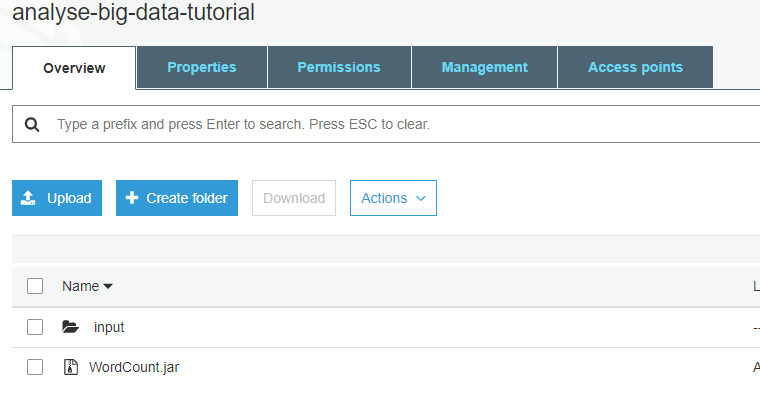
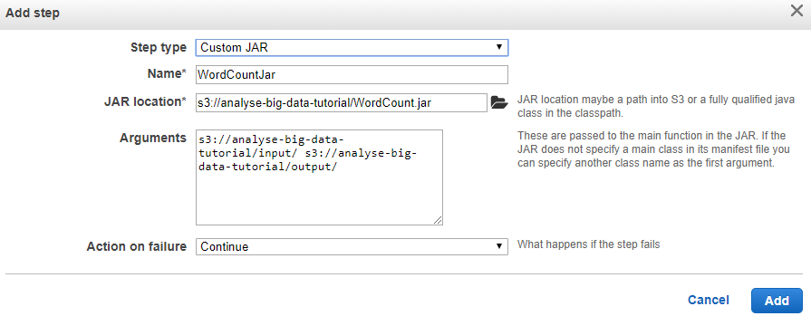
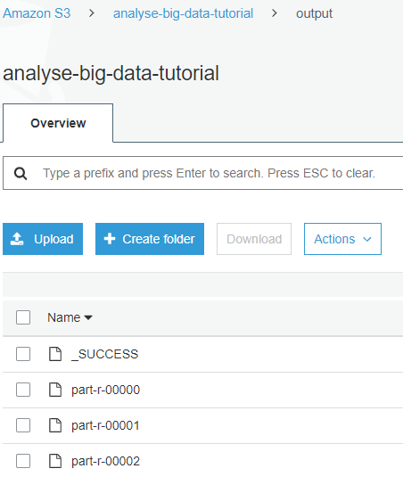

# MapReduce  Sample  codes
This repository contains simple map reduce codes using hadoop mostly written using java.

| Program           | Language | Description                                                 |
|-------------------|----------|-------------------------------------------------------------|
| WordCount         | Java     | Count the number of occurences for each word in input files |
| AverageWordLength | Java     | Measure the average word length of input files.             |

#  How to run on AWS EMR   

1. Setup a cluster with hadoop using CLI or console..      
2. Upload the Jar file and input file to a S3 bucket as below.      

  

3. Add a step with Jar location. Provide arguments for input folder path and where the output should be saved.

  

4. Once completed the step you should observe following output.

  

# How to build Jar with dependencies with Mevan
https://www.baeldung.com/executable-jar-with-maven
